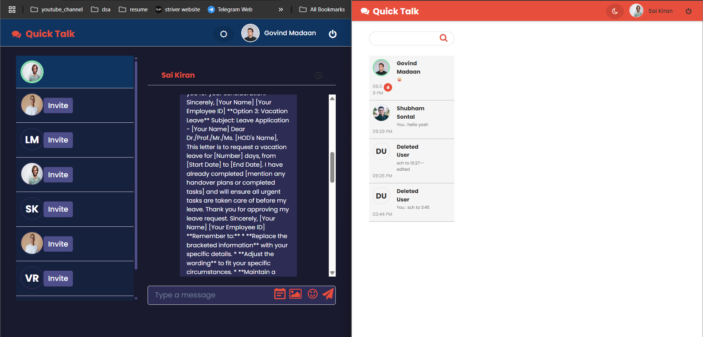

# QuickTalk - Real-time Chat App 
A full-stack, real-time chat application developed using the **MERN (MongoDB, Express.js, React.js, Node.js)** stack.  
It provides users with an interactive messaging platform featuring:

- Email verification via OTP  
- JWT-based authentication  
- Real-time messaging through Socket.io  
- Scheduled messages  
- AI-generated responses
- Online/Offline User Status Tracking in Real Time
- Unread Message Count for better message tracking in Real Time
- Typing Indicator for live engagement
- Toast Notifications for real-time feedback (e.g., "chat created Successfully", "chat already
exist")
- Profile Picture Upload
- Search Result Display with Context
- Selected Chat Highlight & Scrollable Chat View for better UX  

The application is designed with a modern and responsive user interface built using **Chakra UI**, and it leverages **Redux** for managing application state efficiently.  
QuickTalk focuses on delivering a smooth, fast, and engaging chat experience suitable for modern communication needs.

---

**SignUp Page  -** Displays a user-friendly form where new users enter their name, email, and
password to register. On submission, an OTP is sent to the entered email for verification.

---

**Send Email Page  -**  Visual confirmation that an OTP has been dispatched to the user’s email,
enhancing trust and guiding them to check their inbox.

---

**Verify Email Page  -** Allows users to enter the OTP received via email. Validates the OTP to
complete the registration process securely.

---

**Welcome Email Page  -** Depicts the welcome message a new user receives upon successful
signup, confirming account creation and encouraging engagement.

---

**Login Page  -** Provides a secure form for existing users to enter email and password, with real-time
validation and error feedback using toasts.

---

**Light Theme  -** Showcases the application’s interface with a bright, clean appearance suitable for welllit environments, enhancing readability.

---

**Dark Theme  -** Highlights the same interface in a dark color palette to reduce eye strain in lowlight conditions, with smooth theme toggling support.

---

**Profile Page  -**  Allows users to view their profile information and update their profile picture.

---

**User Offline Tracking  -** Indicates users who are currently offline with a visual status
marker, ensuring accurate real-time presence tracking in chat lists.

---

**User Online Tracking and Unread count in real time  -** Displays green status
indicators for users who are online, using Socket.IO to reflect changes instantly in the UI and Shows the
number of unread messages next to each chat. These counters update live when new messages arrive.

---

**Clear Unread Count in Real time  -** Automatically resets the unread message count when a
user opens the chat, maintaining real-time synchronization with the backend.

---

**Chat Management  -** Confirmation interface or toast indicating a new chat has been successfully created
between users after using the invite feature.

---

**Logged Out Toast  -** A toast or redirect screen confirms the user has logged out, with session
cleared and their offline status broadcast to others.

---

**Schedule Message Modal  -** A modal popup where users can compose and schedule a text
message to be delivered at a later time, with calendar and time inputs.

---

**Schedule Message List  -** Displays a list of all messages the user has scheduled for future
delivery. Each entry shows the message content and its scheduled time. Users can view, delete, or edit
scheduled messages.

---

**AI Message Generator Modal  -** A modal that accepts prompts from users and displays AIgenerated responses using Google Generative AI API, integrated directly into the chat.

---

**User Deletion  -** Indicates that a user account has been deleted (soft deletion). The UI reflects this in
real time, and the deleted user is removed from others’ chat lists.

